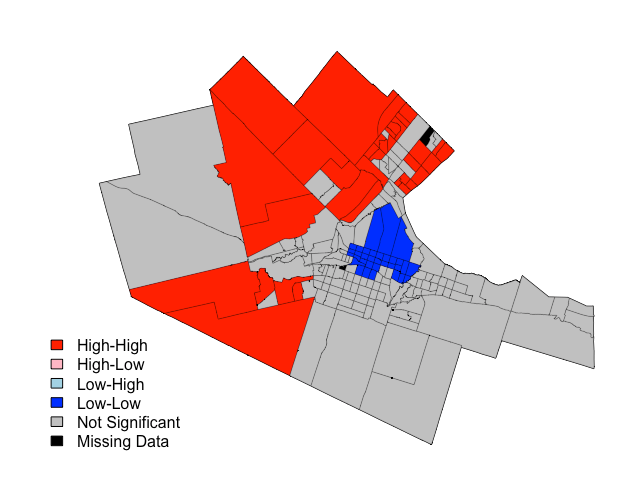

# Plotting results of Local Moran's I statistic generated by localmoran{spdep}

plot.local.moran, produces a cluster plot of Local Moran's I statistic generated by [localmoran{spdep}](https://cran.r-project.org/web/packages/spdep/spdep.pdf).  

Argument | Description
--- | ---
x | spatialpolygonsdataframe
variable.name | double quote variable name, e.g. "houseValue"
local.moran | localmoran object from spdep
weights | spatial weights object from spdep
sig | p value, default is sig = 0.05
plot.only.significant | Plot only the statistically significant clusters, default is TRUE
legend.location | A single keyword "bottomright", "bottom", "bottomleft", "left", "topleft", "top", "topright", "right" and "center".

Example code in an [Rmd file](https://github.com/gisUTM/spatialplots/blob/master/Example%20Local%20Moran%20I%20Hotspot%20Map.Rmd)

## Example Plot

This code is modified from [https://aledemogr.com/2017/10/16/global-and-local-measures-of-spatial-autocorrelation/](https://aledemogr.com/2017/10/16/global-and-local-measures-of-spatial-autocorrelation/)

